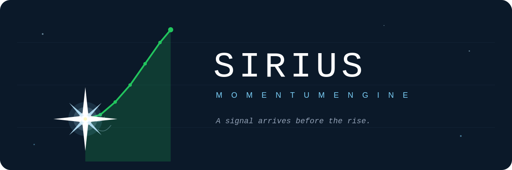

  

  <em>A signal arrives before the rise.</em>

  
  
  
  

---

# Sirius — Momentum Portföy Motoru

ABD hisse senetleri için aylık çalışan momentum tabanlı portföy seçim sistemi. S&P 500 ve Nasdaq 100 evreninden her ay başında en güçlü momentum sergileyen 10 hisseyi seçer.

İsim Antik Mısır'da Nil'in taşmasını müjdeleyen Sirius yıldızından gelir. Gözlenebilir bir sinyal, sonraki bereketin habercisidir. Bu sistem de aynı mantıkla çalışır: her ay başında bir sinyal verir, ardından yükseliş gelir.

## Özellikler

- 🤖 **Tam otonom** — GitHub Actions ile her ayın 1'i 09:00 TSİ otomatik çalışır
- 📱 **Telegram entegrasyonu** — Top 10 listesi otomatik bildirim olarak gelir
- 📊 **7 yıllık backtest** — Yıllık %63 bileşik getiri, 1,67 Sharpe oranı
- 🌍 **Geniş evren** — ~516 hisse (S&P 500 ∪ Nasdaq 100)
- 💰 **Sıfır maliyet** — Tüm bileşenler ücretsiz çalışır

## Özet İstatistikler (Backtest)

| Metrik | Sirius Portföy | S&P 500 (SPY) |
|---|---|---|
| Toplam Getiri (6 yıl) | **%1.806** | %167 |
| Yıllık Bileşik Getiri | **%63,44** | %17,80 |
| Sharpe Oranı | **1,67** | 1,13 |
| Maksimum Drawdown | **-%20,40** | -%23,93 |
| Kazandıran Ay Oranı | **%65,28** | - |

Backtest dönemi: 2020-06 → 2026-05 (72 ay)

## Yıllık Getiri Dağılımı

| Yıl | Sirius | S&P 500 | Fark |
|---|---|---|---|
| 2020 | +%76,21 | +%24,42 | **+%51,79** |
| 2021 | +%31,26 | +%28,73 | +%2,54 |
| 2022 | +%10,66 | -%18,18 | **+%28,83** |
| 2023 | +%39,94 | +%26,18 | +%13,76 |
| 2024 | +%76,16 | +%24,89 | **+%51,28** |
| 2025 | +%57,75 | +%17,72 | **+%40,03** |
| 2026 (5 ay) | +%91,52 | +%9,93 | **+%81,58** |

Sistemin en dikkat çekici özelliği 2022 ayı piyasasında pozitif getiri sağlaması. S&P 500 -%18 kaybederken Sirius +%10,66 kazandırdı. Bu, çoklu lookback (3+6+12 ay) yapısının trend dönüşlerini hızlı yakalamasından kaynaklanır.

## Sistem Nasıl Çalışır

### Evren
- S&P 500 üyeleri (~503 hisse)
- Nasdaq 100 üyeleri (~101 hisse)
- Birleşik evren: ~516 hisse
- Veri filtresi sonrası: ~500 hisse

### Skor Hesaplama
Her ay sonunda her hisse için kompozit momentum skoru hesaplanır:

1. Son 3 aylık getiri
2. Son 6 aylık getiri
3. Son 12 aylık getiri

Her getiri yüzdelik dilime çevrilir, üçünün ortalaması alınır. En yüksek skorlu 10 hisse seçilir.

### Portföy Kuralları
- **Hisse sayısı:** 10
- **Ağırlık:** Eşit (%10 her hisse)
- **Rebalans:** Aylık (her ayın ilk işlem günü)
- **Çıkış kuralı:** Skor sıralamasında ilk 10'un dışına çıkanlar elenir

## Otomatik Çalıştırma

Sistem **her ayın 1'i 09:00 Türkiye saatinde** otomatik olarak GitHub Actions üzerinde çalışır:

1. GitHub sanal makinesinde Python 3.11 başlatılır
2. Bağımlılıklar yüklenir
3. Hisse evreni Wikipedia'dan çekilir
4. Yahoo Finance üzerinden fiyat verisi indirilir
5. Momentum skorları hesaplanır
6. Top 10 hisse seçilir
7. Telegram bot üzerinden bildirim gönderilir

Tüm süreç ~3 dakika sürer ve kullanıcı müdahalesi gerektirmez.

Workflow durumunu görmek için: [Actions sekmesi](https://github.com/Mimar2026/sirius/actions)

## Manuel Çalıştırma

Bağımlılıkları yükle ve scripti çalıştır:

    pip install -r requirements.txt
    python momentum_system.py
    python backtest.py

## Telegram Bildirimi

Telegram entegrasyonu için ortam değişkenlerini ayarla:

    export TELEGRAM_BOT_TOKEN="bot_tokeniniz"
    export TELEGRAM_CHAT_ID="chat_id_niz"
    python momentum_system.py

Bot kurulumu için [BotFather](https://t.me/BotFather) üzerinden bot oluştur ve token al.

## Dosya Yapısı

    sirius/
    ├── .github/workflows/
    │   └── monthly_run.yml
    ├── assets/
    │   ├── sirius_avatar.png
    │   ├── sirius_avatar_hd.png
    │   ├── sirius_banner.png
    │   └── ...
    ├── README.md
    ├── momentum_system.py
    ├── backtest.py
    └── requirements.txt

## Sistem Hakkında Notlar

### Güçlü Yönler
- **Tutarlı outperformance:** 6 yılın 6'sında da S&P 500'ü yendi
- **2022 ayı piyasasında pozitif getiri** — momentum stratejileri için olağandışı
- **Düşük max drawdown** — Çoklu lookback rejim değişikliklerini hızlı yakalar
- **Yüksek Sharpe oranı** (1,67) — Risk-ayarlı getiri üstün

### Riskler
- **Survivorship bias:** Backtest şu anki S&P 500 üyelerini kullanır. Gerçek getiri %5-15 daha düşük olabilir
- **İşlem maliyetleri** hesaplanmamış (~%1-3/yıl)
- **Vergi:** Aylık rebalans → yüksek kısa vadeli sermaye kazancı vergisi
- **Konsantrasyon riski:** Top 10 ağırlıklı olarak teknoloji/yarı iletken sektöründe
- **Momentum crash riski:** Trend dönüşlerinde sert düşüşler yaşanabilir

## Veri Kaynakları

- **Fiyat verisi:** [yfinance](https://github.com/ranaroussi/yfinance)
- **Hisse listesi:** Wikipedia (S&P 500, Nasdaq 100)

## Teknoloji Yığını

Python 3.11, pandas, numpy, yfinance, lxml, beautifulsoup4, requests, GitHub Actions, Telegram Bot API

## Yol Haritası

- [x] Temel momentum modeli (3+6+12 ay kompozit skor)
- [x] Backtest motoru (7 yıllık tarihsel test)
- [x] Telegram bildirimi
- [x] GitHub Actions ile otomatik aylık çalıştırma
- [ ] Hata yakalama ve retry mantığı
- [ ] Geçmiş seçimler logu
- [ ] Quality faktörü (ROE, kâr büyümesi, brüt marj)
- [ ] Sektör çeşitlendirme kuralı
- [ ] Düşük volatilite filtresi
- [ ] QuantConnect entegrasyonu
- [ ] BIST evrenine uyarlama (katılım vs genel)
- [ ] Dashboard (web arayüzü)

## Uyarı

Bu proje **eğitim ve araştırma amaçlıdır**. Yatırım tavsiyesi değildir. Geçmiş performans gelecek getiri garantisi vermez.

## Lisans

MIT License

---

  Built with care, guided by a star.

